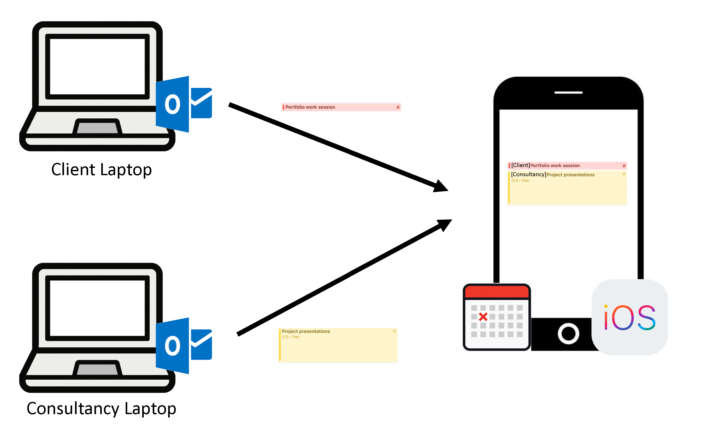




# CalendarSync

**CalendarSync** is a lightweight .NET-based background application that performs a **one-way sync from Microsoft Outlook to Apple iCloud Calendar** using CalDAV. 
As a COM-Interop application it is optimized to run silently via a Scheduled Task on Windows systems - without relying on Microsoft Graph or full Exchange integration.

## Features

- One-Way syncs events from **local Outlook calendar** to **Apple iCloud calendar**
- Adds a **10-minute** and **3-minute alarm notification** for timed events (no reminders on all-day or multi-day entries)
- Runs silently and logs to `sync.log`
- Designed for **restricted corporate environments** — no UI required
- Tray icon with status tooltip
- Ability to sync multiple source calendars into the target:
    1. Ideal for multiple machines handed out by the consultancy and client
    2. Cleanly separates and manages multiple sources
    3. Ability to visually 'tag' entries from sources



## Requirements

- Windows with Outlook installed and configured
- iCloud Calendar with CalDAV access
- .NET 8.0 or newer
- Basic access to Scheduled Tasks (admin rights only for registration)

## Quickstart

### 1. Build & Deploy

- Compile the app (`Release` mode).
- Copy the output (`.exe` + `config.json`) to a permanent path, e.g.:

```
C:\CalendarSync\
```

- Fill in `config.json` with your iCloud credentials and calendar info:

```json
{
    "ICloudCalDavUrl": "https://caldav.icloud.com",
    "ICloudUser": "your_apple_id@icloud.com",
    "ICloudPassword": "app-specific-password",
    "PrincipalId": "XXXXXXXXX",
    "WorkCalendarId": "YYYYYYYYY",
    "InitialWaitSeconds": 60,
    "SyncIntervalMinutes": 3,
    "SyncDaysIntoFuture": 30,
    "SyncDaysIntoPast": 30,
    "LogLevel": "Information",
    "SourceId": "in_case_you_want_to_sync_from_multiple_calendars",
    "EventTag": "this_marks_an_entry_with_a_prefix_e.g_ [COMPANY]",
    "SourceTimeZoneId": "Europe/Berlin",
    "TargetTimeZoneId": "Europe/Berlin"
}
```

Use a browser Dev Tools or CalDAV client to retrieve `PrincipalId` and `WorkCalendarId`.

`SourceTimeZoneId` and `TargetTimeZoneId` are optional. When omitted, the service falls back to the host operating system's local timezone for both the Outlook source and the iCloud destination.

### 2. Register as a Scheduled Task

Manual Method:

1. Open `Task Scheduler` → `Create Task`
2. General Tab:
   - Name: `CalendarSync`
   - Run only when user is logged on
   - Run with highest privileges
3. Triggers Tab: Add → `At log on`
4. Actions Tab:
   - Start a program → `C:\CalendarSync\CalendarSync.exe`

## Logs

Logs are written to:
```
C:\CalendarSync\sync.log
```
High level events are also written to the Windows Event Log under the
"Application" log. Run the program once as administrator to register the
"CalendarSync" event source.

## Security

- Does not store or sync from iCloud to Outlook
- Passwords handled via basic auth over HTTPS

## Outlook COM Reliability

- Uses a dedicated STA thread with timeouts to prevent Outlook UI hangs.

## Notes

- Outlook must be configured and ready on the host
- iCloud must be accessible via CalDAV (app-specific password required)

## License

MIT — use at your own risk and discretion.
